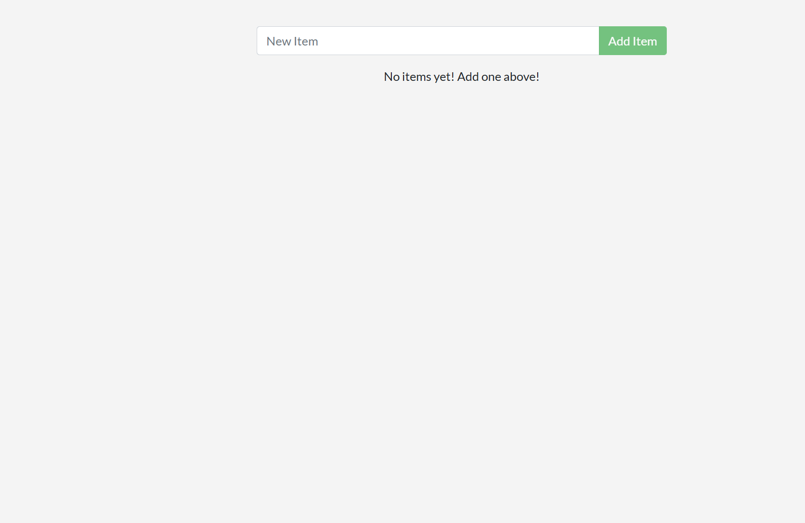

# ToDo-Applikation – Node.js & Docker

## Projektbeschreibung

Dieses Projekt ist eine einfache **ToDo-Applikation**, die mit *Node.js* umgesetzt wurde.

In dieser Übung habe ich das Repository [`docker-nodejs-sample`](https://github.com/ICT-BLJ/docker-nodejs-sample) geforkt (kopiert) und auf meinem Computer eingerichtet. Danach habe ich die Anwendung für **Docker** vorbereitet. Dabei habe ich mich an der [offiziellen Docker-Anleitung für Node.js](https://docs.docker.com/language/nodejs/) orientiert.

## Voraussetzungen

Damit die Anwendung ausgeführt werden kann, müssen folgende Programme installiert sein:

- Node.js
- Git (VS-Code)
- Docker Desktop

## Repository klonen

Klone das Repository mit folgendem Befehl auf deinen Computer:

```git clone https://github.com/ayavan67/docker-nodejs-sample```

Wechsle anschliessend in das Projektverzeichnis:

```cd docker-nodejs-sample```

## Pakete installieren

Installiere Node.js zuerst, danach gebe diesen befehl im bash hinein.

```npm install```

## Anwendung lokal starten

Starte die Anwendung im Entwicklungsmodus mit:

Bevor wir npm start nutzen müssen wir ```start": "node src/index.js"```im "scripts" hinein tun.
Danach:
```npm start```

Die Anwendung ist danach unter folgender Adresse im Browser erreichbar:

```http://localhost:3000```


