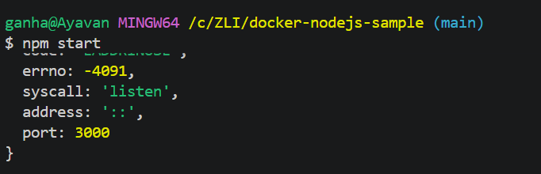

# ToDo-Applikation – Node.js  Docker

## Projektbeschreibung

Dieses Projekt ist eine einfache **ToDo-Applikation**, die mit *Node.js* umgesetzt wurde.

In dieser Übung habe ich das Repository [`docker-nodejs-sample`](https://github.com/ICT-BLJ/docker-nodejs-sample) geforkt (kopiert) und auf meinem Computer eingerichtet. Danach habe ich die Anwendung für **Docker** vorbereitet. Dabei habe ich mich über die [offiziellen Docker-Anleitung für Node.js](https://docs.docker.com/language/nodejs/) informiert.

## Voraussetzungen

Damit die Anwendung ausgeführt werden kann, müssen folgende Programme installiert sein:

- Node.js
- Git (VS-Code)
- Docker Desktop

## Repository klonen

Klone das Repository mit folgendem Befehl auf deinen Computer:

`git clone https://github.com/ayavan67/docker-nodejs-sample`

Wechsle anschliessend in das Projektverzeichnis:

`cd docker-nodejs-sample`

## Pakete installieren

Installiere Node.js zuerst, danach gebe diesen befehl im bash hinein.

`npm install`

## Anwendung lokal starten

Starte die Anwendung:

Bevor wir **"npm start"** nutzen müssen wir `start": "node src/index.js"`im "scripts" hinein tun.
Danach:
`npm start`

Die Anwendung ist danach unter folgender Adresse im Browser erreichbar:

`http://localhost:3000`

## Docker-Image erstellen

Um die Anwendung in einem Docker-Container auszuführen, muss zuerst ein **Docker-Image** gebaut werden. Dies macht man mit `Dockerfile` im Projektverzeichnis:

`docker build -t todo-app .`

**Erklärung der Optionen:**

## Anwendung mit Docker starten

Nachdem das Image erstellt wurde, kann ein Container davon gestartet werden:

`docker run --name todo-container -p 3000:3000 todo-app`

**Erklärung der Optionen:**

- `-d` – startet den Container im Hintergrund (*detached mode*)
- `-p 3000:3000` – verbindet den Port `3000` des Containers mit dem Port `3000` des Computers
Die Anwendung ist danach wie gewohnt unter `http://localhost:3000` erreichbar.

## Anwendung mit Docker Compose starten

Alternativ kann die Anwendung auch mit **Docker Compose** gestartet werden.

`docker compose up -d`

Docker Compose liest dabei die Konfiguration aus der Datei `compose.yaml`und startet automatisch den Container

## Anwendung stoppen

**Bei Docker Compose:**
`docker compose down`
